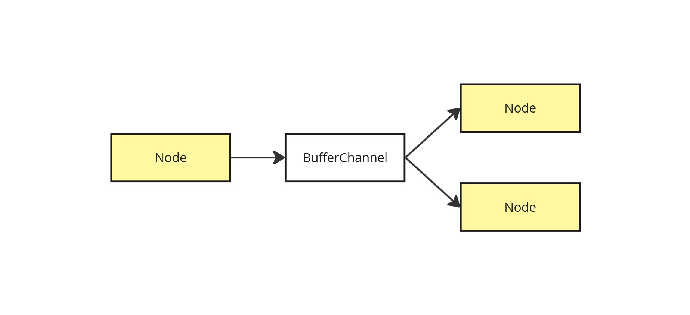
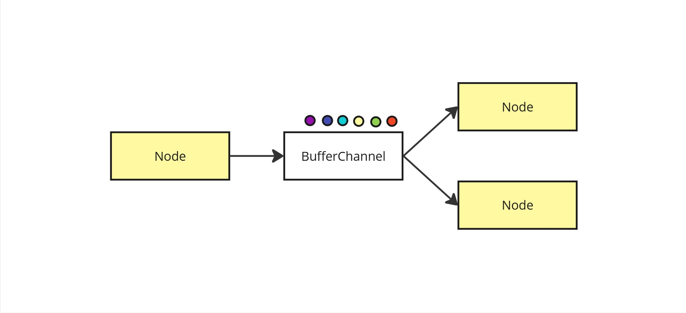
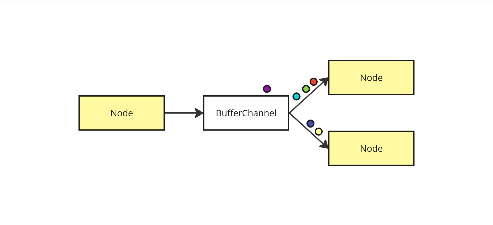
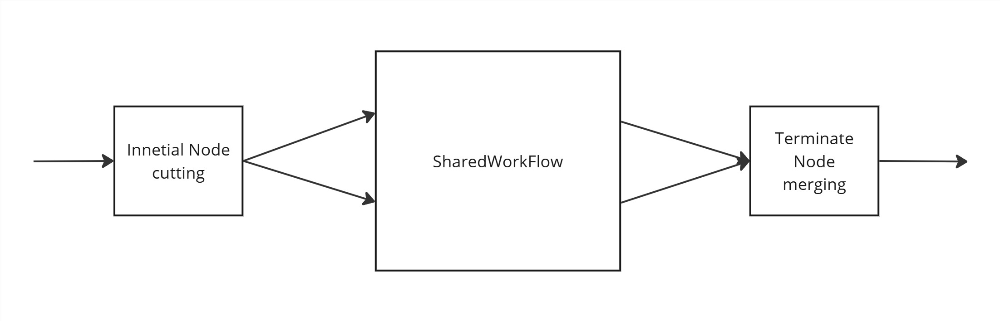

# kotlin-dsl-pipeline

## Структура проекта

В рамках проекта создается:
- [core](/core) framework для определения конвейерной обработки данных через проблемно-ориентированный язык (DSL);
- [picture-pipelines](/picture-pipelines) реализация модельной задачи конвейерной обработки изображений;

## Предметная область

**Конвейер** (workflow) представляет собой совокупность типизированных каналов (pipe) и узлов обработки (node).

**Типизированный канал** (pipe) - это линейное хранилище типизированных объектов и предоставляющий интерфейс:
- добавление нового объекта;
- добавление обработчика, реагирующего на добавление нового элемента;

**Узел обработки** (node) - это действующая единица конвейера, определяющая способ обработки входных каналов и добавления элементов в выходные каналы.

**Состояние** (контекст) **конвейера** - это совокупность состояний узлов обработки и типизированных каналов. За операцию изменяющую контекст стоит понимать любую атомарную операцию, изменяющую состояния узлов обработки или каналов.

**Состояние узла обработки** - это совокупность объектов, находящиеся в обработки в данном узле.

**Состояние типизированного канала** - это совокупность объектов хранящихся в канале.

Конвейер может находиться в следующих **состояниях**:

| Состояние       | Описание                                                                                                                                                |
| --------------- |---------------------------------------------------------------------------------------------------------------------------------------------------------|
| Инициализирован | Дефолтное состояние созданного конвейера, когда происходят инициализация внутренних компонентов, исходя из описанного пользователем DSL  его остановке. |
| В работе        | Состояние наступающее по действию пользователя, при котором идет независимое друг от друга исполнение узлов обработки типизированных каналов.           |
| В зависании     | Состояние наступающее, когда за меньше чем N количество изменений состояний конвейера он переходит в такое же состояние.                                |
| Завершен        | Дефолтное состояние конвейера при принудительной его остановке пользователем.                                                                           |

## Требования

### Базовая часть

| Требование                                                          | Описание                                                                                      |
| ------------------------------------------------------------------- | --------------------------------------------------------------------------------------------- |
| Узлы контейнера имеют наборы входных и выходных каналов             | В рамках реализации требования планируется ограничение до 3 входных и выходных потоков        |
| Компоновка узлов и каналов поддается статическому контролю типизации | Нет возможности нарушить типизацию узлов на этапе написания кода                              |
| Независимое исполнонение узлов                                      | Исполнение узлов на виртуальных потоках с использованием определенного пула системных потоков |

### Дополнительная часть

| Требование                         | Описание                                                                                 |
|------------------------------------| ---------------------------------------------------------------------------------------- |
| Обобщенные части конвейеров        | В рамках реализации требования планируется ограничение до 3 входных и выходных потоков   |
| Поддержка обработки циклов в графе | Вывод предупреждения  при инициализации конвейера                                        |
| Обработка зависаний конвейера      | Выброс исключений, когда конвейер, находящийся в работе, переходит в состояние зависания |

## Структура DSL

### Workflow

Корневое доменное слово, используется для определения частей конвеера и их взаимосвязей

```kotlin
Workflow(
	dispatcher: CoroutineDispatcher,
	countStackContext: Int,
	enableSecurityDeadLock: Bool,
	enabledWarringCyclePipe: Bool,
	updateContext: (Workflow.Context)-> Unit) {
// Сборка конвейера в контексте WorkflowBuilder
}
```
#### Параметры

| Названия                    | Тип                         | Значение по умолчанию       | Назначение                                                                                                                                                                                                                              |
| --------------------------- | --------------------------- | --------------------------- |-----------------------------------------------------------------------------------------------------------------------------------------------------------------------------------------------------------------------------------------|
| **dispatcher**              | `CoroutineDispatcher`       | CoroutineDispatcher.Default | Параметр определяет [контекст](https://kotlinlang.org/docs/coroutine-context-and-dispatchers.html) виртуальных потоков - [корутин](https://kotlinlang.org/docs/coroutines-basics.html), в которых независимо исполняются узлы конвейера. |
| **countStackContext**       | `Int`                       | 10                          | Параметр обозначает количество хранящиеся в стеке состояний.                                                                                                                                                                            |
| **enableSecurityDeadLock**  | `Bool`                      | false                       | Параметр включает проверку на состояния зависания конвейера. При выявлении изменения состояния конвейера выбрасывается исключение.                                                                                                      |
| **enabledWarringCyclePipe** | `Bool`                      | false                       | Параметр включает проверку конвейера на этапе инициализации. При выявлении циклов в зависимостях между узлами, в консоли выводится предупреждение о возможных негативных последствиях.                                                  |
| **updateContext**           | `(Workflow.Context)-> Unit` | {}                          | Функция обработчик, вызываемая при каждом изменении состоянии конвейера.                                                                                                                                                                |

#### Компоненты
##### sharedWorkflow

Для создания шаблонов конвейеров (`SharedWorkflow`) предлагается использовать функции, в параметрах которых обозначаются переиспользуемые компоненты, а возращаемым результатом будет `SharedWorkflow`
```kotlin
fun mySharedWorkflow(input: Pipe<Int>, output: Pipe<Int>, firstParam: Int): SharedWorkflow =  
    SharedWorkflow {  
  
        node(  
            name = "Пример",  
            input = input,  
            output = output  
        ) { comsumer, producer ->  
         // logic 
        }  
    }
```

##### node

```kotlin
node(  
    name = "Первая нода",  
    input = Pair(pipe1, pipe2),  
    output = Pair(pipe3, pipe4)  
) { consumerPipe1, cosumerPipe2, producerPipe3, producerPipe4 ->  
    // Define the action logic here  
  
    println("Executing action for node 'Первая нода'")  
    // e.g., Use producers and consumers as needed  
}
```

###### Параметры

| Названия   | Тип                                         | Значение по умолчанию | Назначение                                |
| ---------- | ------------------------------------------- | --------------------- | ----------------------------------------- |
| **name**   | `String`                                    | Нет                   | Название узла, используемого в логгировании |
| **input**  | `Pipe<T>` \| `Pair<T,Q>` \| `Triple<T,Q,S>` | Нет                   | Входящие в узел типизированные каналы     |
| **output** | `Pipe<T>` \| `Pair<T,Q>` \| `Triple<T,Q,S>` | Нет                   | Выходящие из узла типизированные каналы   |

###### Компоненты

Передается анонимная функция, в параметрах которых последовательно (как это указано в параметрах) передаются интерфейсы для взаимодействия с типизированным каналом.

#### Функции

| Название | Назначение                                                                                                          |
| -------- | ------------------------------------------------------------------------------------------------------------------- |
| start    | Конвейер переходит в состояние `В работе`                                                                           |
| pause    | Конвейер останавливает исполнение узлов                                                                             |
| stop     | Конвейер перходит в состояние `Завершен`, очищается котекст узлов и каналов, принудительно завершаются все корутины |

###  Pipe

Типизированный канал.
#### Consumer

Внутренний класс, предоставляющий интерфейс для добавления обработчиков новых элементов в канале.

##### Операторы

| Название | Назначение                                                                                                 |
| -------- | ---------------------------------------------------------------------------------------------------------- |
| `plus`   | Сложение `Consumer` необходимо для создание атомарной операции чтения нового значения сразу из двух каналов |

##### Функции

###### onListener

| Параметры | Назначение                      |
| --------- | ------------------------------- |
| `action`  | Функция обработчик всех занчений|

###### receive

| Параметры | Назначение                       |
| --------- | -------------------------------- |
|           | Функция одного атомарного чтения |

#### Producer

Внутренний класс, предоставляющий интерфейс для добавления элементов в канал.

##### Операторы

| Название | Назначение                                                                                                 |
| -------- | ---------------------------------------------------------------------------------------------------------- |
| `plus`   | Сложение `Producer` необходимо для создание атомарной операции чтения нового значения сразу из двух каналов |

##### Функции

###### commit

| Параметры | Назначение                    |
| --------- | ----------------------------- |
| `value`   | Значение передаваемое в канал |

## Реализация

[SharedFlow](https://www.kodeco.com/22030171-reactive-streams-on-kotlin-sharedflow-and-stateflow)

### Pipes

Pipes расширение [Koltin Channel](https://kotlinlang.org/docs/channels.html#channel-basics).  

**Kotlin Channel** концептуально очень похож на BlockingQueue. Одно ключевое отличие состоит в том, что вместо блокирующей put операции у него есть приостанавливающая send, а вместо блокирующей take операции у него есть приостанавливающая receive.  

**Pipeline** - это шаблон, в котором одна сопрограмма создает, возможно, бесконечный, поток значений, а другая сопрограмма или сопрограммы потребляют этот поток, выполняют некоторую обработку и производят некоторые другие результаты.  




### Задача с независимым исполнением nodes

Используются [виртуальные потоки Kotlin](https://kotlinlang.org/docs/coroutines-basics.html#your-first-coroutine) или корутины.  

**Корутина** — это экземпляр приостанавливаемого вычисления. Мы можем приостановить выполнение корутины, чтобы позволить другим корутинам отработать в том же потоке. В дальнейшем выполнение этой корутины может быть возобновлено в том же или даже в другом потоке. В момент приостановки работы корутины связанные с ней вычисления останавливаются, сохраняются в памяти и удаляются из потока, позволяя ему свободно заниматься другими задачами.  

Вызов **suspend-функции** приостанавливает выполнение функции и позволяет потоку выполнять другие действия. Через некоторое время приостановленная функция может быть возобновлена в том же или другом потоке.  

Каждая nodes запускается в отдельном корутине с возможностью управлять состоянием корутины. 

### Предметная задача

Использовалась библиотека [editimage](https://github.com/simoska4/editimage)  

  

Для преобразований созданы 6 node
